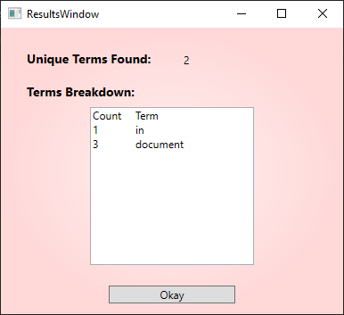

# DocSearcher

This tool is designed as a personal tool to search documents for a set of terms. These terms can be found in a document and the tool will output the number of terms found in the document, as well as how many times each term appeared.

When searching .pdf files, note that it is much more accurate to first save the document as another file type, such as .htm or .html, before loading and searching it.

## How To

To use this tool:

1. Select a file using the Choose File button.
2. Add Search Terms in the text area on the right.
3. Click Search.

After searching, the user will see a results page where the unique number of terms is shown, as well as a breakdown with the frequencies for each individual term that appeared in the document.

## Releases

Below is a list of zipped versions of the tool.

2021-02-01 [v1.0-4-ge5094a9](Versions/1.0-4-ge5094a9.zip)